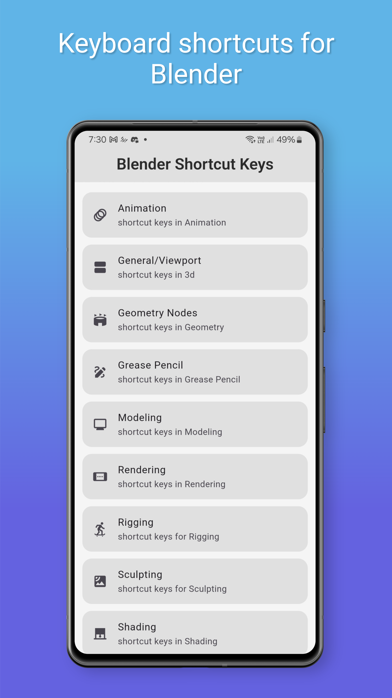
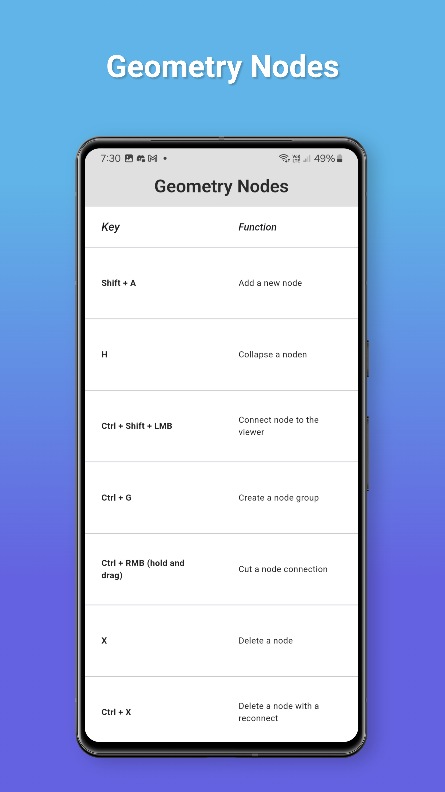
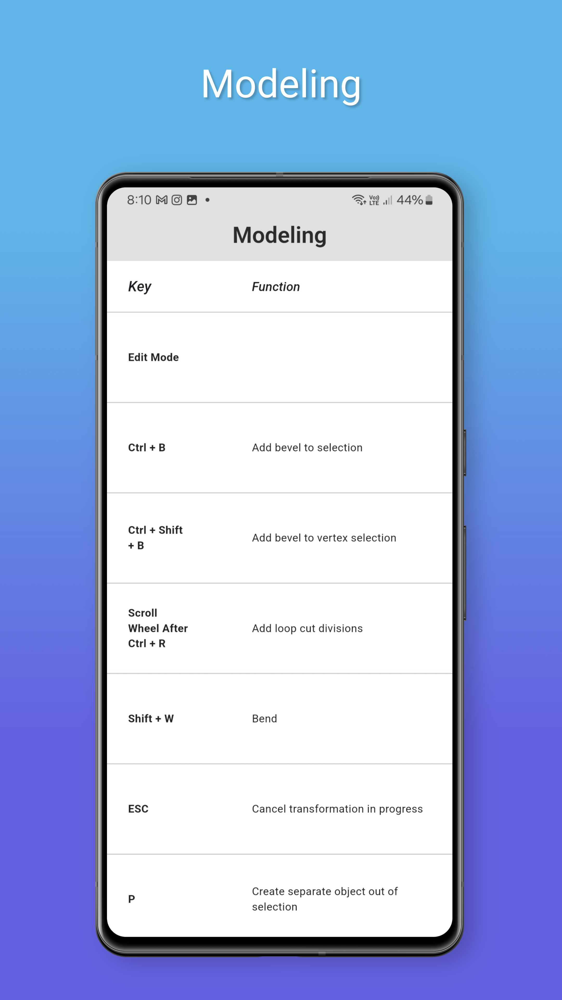

# blender_keys

<!--  -->
<!--  -->
<!--  -->
<!--  -->

<table>
  <tr>
    <td></td>
    <td></td>
  </tr>
  <tr>
    <td></td>
    <td></td>
  </tr>
</table>

shortcut keys for blender
This project is a project to learn flutter application
